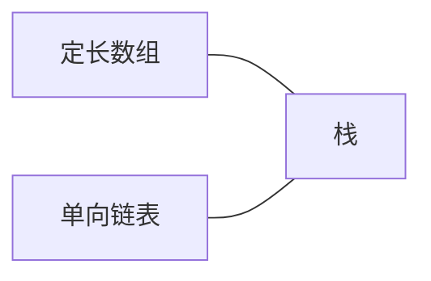
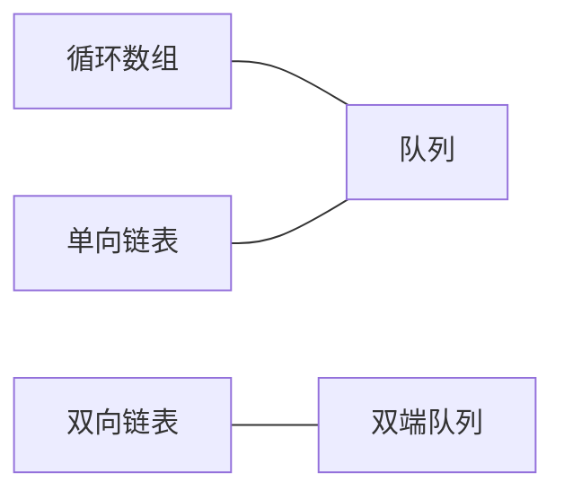
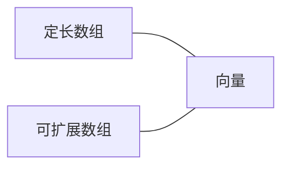
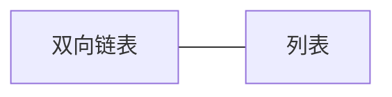
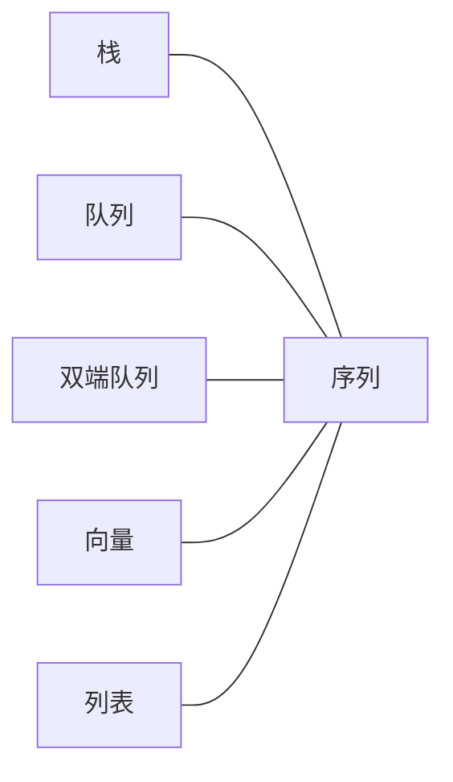

在学习邓俊辉所写 《数据结构与算法》 (Java描述)时，记下一些内容以便参考。

持续更新中...

<!-- more -->

## 基本数据结构一览











## 概念

本文中对 **声明** 和 **定义** 两个术语的使用参考 StackOverflow 上对于问题 [What is the difference between declaration and definition in Java?](https://stackoverflow.com/questions/11715485/what-is-the-difference-between-declaration-and-definition-in-java) 的第一个回答中关于 **方法** 的声明和定义的区别。而对于类和变量，本文仅使用定义。

具体使用总结为下面的例子:

```java
abstract class SomeClass {                // class declaration
                                          //                          \
    int x;                                // variable declaration      |
                                          //                           |
    public abstract void someMethod();    // function declaration      |
                                          //                           |
    public int someOtherMethod() {        // function declaration      |
                                          //                           | class
        if (Math.random() > .5)           // \                         | definition
            return x;                     //  |  function definition   |
        else                              //  |                        |
            return -x;                    // /                         |
                                          //                           |
    }                                     //                           |
}                                                                     /
```

## ADT 定义

* 定义 ADT 接口

  * 声明 ADT 接口所支持的方法

* 定义相应的异常类

  * 根据方法可能出现的异常，在 ADT 接口的方法声明中使用 throws 声明所抛出的异常

## ADT 实现类

需要注意的细节

* 某些成员变量和方法需要用 protected 修饰，使之能被扩展，但实现的接口中的方法都是 public

* 需要遍历的方法不能修改 ADT 对象的内容

## 链表

单链表：next 指向 null 的节点才是表末节点

## Java 基础知识复习

### 接口方法声明未抛出异常，但方法的实现需要抛出异常而不能就地处理异常

* 如果接口的方法声明中没有抛出异常(throws)，那么其实现类就不能在方法声明中抛出异常(throws)。

* 如果实现类自身处理(try-catch)异常不符合逻辑，那么只能抛出。

基于以上两点，只能在方法体内 `throw` 需要抛出的异常。
但是，如果需要抛出的异常是 **checked exception**, 又必须在方法声明中 `throws` 要抛出的异常。
因此只能从异常类的定义上入手，使要抛出的异常类继承自 `RuntimeException`， 而不是 `Exception`，
使要抛出的异常成为 **unchecked exception**。

例如：

在基于定长数组实现 Stack 的类 ArrayStack 中 push 方法的定义需要抛出 ArrayStackFullException，
但 push 方法是从接口 Stack 继承而来，所以不能在方法声明中 throws, 若要 try-catch,则不符合逻辑，
因为此处不需要处理此种异常，因为这是上层用户使用 ArrayStack 不当产生的异常，所以需要向上抛出，而不是就地处理，
因此，只能修改 ArrayStackFullException 定义，使之继承自 RuntimeException 而不是 Exception

---
于2017-11-29 记录

如果 **Overridden** 的方法声明中没有 `throws` 异常，那么 `@Override` 方法不能在其方法声明中 `throws` 检查异常，却能 `throws` RuntimeException。

### Sundry

通过Arrays.asList产生的集合的contains方法不能对基本类型使用

在幂函数计算中发现，如果表达式中包含了相同的子表达式，或者一个子表达式的计算包含了另一个子表达式的计算，由于程序时顺序执行的，
所以相同的计算会进行多次，大规模问题会非常耗时，应当使之只运算一次,简单的情况，可以将第一次的结果保存到变量v中，而第二个子表达式不再进行计算，
转而使用刚才已经运算完成的值，也就是变量v保存的值。也就是减少重复和冗余计算

运算符的结合性是指优先级相同时的运算顺序
